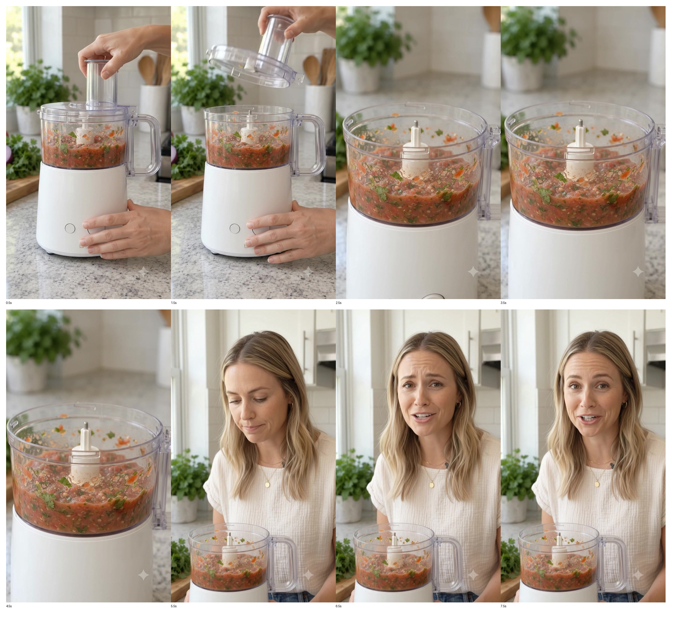

# UGC Product Review Skill

[](https://agentskills.io)
[](https://agent-plugins.org/)
[](https://github.com/ptrgiang/ugc-product-review-skill/actions/workflows/validate-skill.yml)
[](LICENSE)
[](https://github.com/ptrgiang/ugc-product-review-skill/stargazers)
[](CONTRIBUTING.md)

English · [Tiếng Việt](README.vi.md)

A modular Agent Skill for turning product references into **realistic UGC product-review video concepts and generation-ready prompts**.

It is built around one idea: an agent should load only the production knowledge that matters for the current product and task.

> **Visual proof > marketing claims · Product fidelity > cinematic complexity · Human imperfection > commercial polish**

## See it work

This repository treats generated output as evidence, not decoration. Showcase cases preserve the chain:

```text
product reference → agent route → production prompt → real generation → QA → targeted repair
```

### Featured real-generation case

**Google Flow / Veo · countertop appliance · multi-state UGC**

The first showcase case tests a difficult appliance sequence with a fixed product reference, lid interaction, control interaction, processing state, result reveal, and creator verdict.

A real generation exposed a practical 8-second clip constraint. V02 therefore moved to a **2 × 8s split-clip production plan**, but clip 2 introduced a continuation-state regression. V03 repaired only that root cause with an immutable opening-state contract.

**V03 — targeted repair result**

https://github.com/user-attachments/assets/b286e7c8-c2ea-4385-b421-6044d13a2cc9



**V01 QA:** `13 / 16`  
**V03 QA:** `15 / 16` — **PASS**

The full showcase preserves all V01, V02, and V03 videos, contact sheets, prompts, QA notes, failure tags, and repair reasoning.

- [View the product reference](examples/showcase/evidence/flow-appliance-001/reference-product.jpg)
- [Open the showcase index](examples/showcase/README.md)
- [Open the full appliance case](examples/showcase/appliance-multistate-google-flow.md)
- [Open the evidence bundle](examples/showcase/evidence/flow-appliance-001/README.md)

The showcase records what worked, what failed, the QA tags, and why each prompt revision changes only the affected production decisions. This follows a proof-first pattern: show the actual output, disclose the prompt, and make evaluation reproducible rather than presenting polished claims alone.

## Why this exists

Generic video prompts often produce attractive but unusable results: the product changes shape, hands interact incorrectly, the creator overacts, the hook feels scripted, or every campaign variation looks the same.

This skill gives coding agents and general-purpose agents a reusable production system for:

- product diagnosis and creative-angle selection
- hooks, first frames, shot graphs, and hero moments
- product and creator consistency
- category-specific hand and physics constraints
- single prompts, clip packs, batches, and campaigns
- generated-video QA and targeted prompt repair
- performance-driven creative iteration

## Install

### Fastest cross-agent path

```bash
npx skills@latest add ptrgiang/ugc-product-review-skill --skill ugc-product-review
```

Install globally:

```bash
npx skills@latest add ptrgiang/ugc-product-review-skill --skill ugc-product-review -g
```

Install to a specific agent:

```bash
npx skills@latest add ptrgiang/ugc-product-review-skill --skill ugc-product-review -a claude-code
npx skills@latest add ptrgiang/ugc-product-review-skill --skill ugc-product-review -a codex
```

List the skills detected in this repository:

```bash
npx skills@latest add ptrgiang/ugc-product-review-skill --list
```

### GitHub CLI

Recent GitHub CLI versions include the preview `gh skill` workflow.

Preview before installing:

```bash
gh skill preview ptrgiang/ugc-product-review-skill ugc-product-review
```

Install directly:

```bash
gh skill install ptrgiang/ugc-product-review-skill ugc-product-review --agent claude-code
gh skill install ptrgiang/ugc-product-review-skill ugc-product-review --agent codex
```

The repository also ships a root `plugin.json` conforming to Agent Plugins 1.0 so compatible plugin hosts can discover the skill from the standard `skills/` directory.

You can always copy `skills/ugc-product-review/` manually into the skills directory used by your agent.

See [Compatibility](docs/COMPATIBILITY.md) for details.

## Quick start

Give the agent a product image or product information and ask:

```text
Create a realistic 12-second UGC review video for this product.
```

The skill should autonomously:

1. identify the product type and confidence level,
2. find the strongest visible proof,
3. infer the likely buyer motivation or objection,
4. choose the strongest review angle,
5. design the hook, first frame, emotional arc, and hero moment,
6. build a physically plausible shot sequence,
7. compile a generation-ready prompt,
8. suggest genuinely different alternatives.

### Campaign example

```text
Create 10 different UGC review concepts for this product. Avoid duplicate hooks and make the campaign cover attention, consideration, trust, and conversion.
```

### Repair example

```text
The generated video changes the product shape and the hands look wrong. Diagnose the failure and repair only the affected prompt sections.
```

## Progressive disclosure

The canonical skill is intentionally small. Detailed knowledge lives in focused reference modules that are loaded only when relevant.

```text
SKILL.md
   │
   ├─ core.md                     always
   ├─ creative-strategy.md        concept selection
   ├─ prompt-compiler.md          final prompt generation
   ├─ model-adapters.md           only when target model matters
   ├─ campaign-engine.md          batches / campaign planning
   ├─ qa-and-repair.md            generated-video QA / prompt repair
   ├─ performance-learning.md     only when metrics are supplied
   ├─ commerce-and-claims.md      claim-sensitive or commercial work
   └─ categories/                 one product category when possible
```

This follows the Agent Skills progressive-disclosure model: metadata is cheap to discover, `SKILL.md` loads on activation, and supporting references load only when the task needs them.

## Supported product modules

| Module | Examples |
| --- | --- |
| Appliances | kitchen appliances, machines, mechanical home products |
| Fashion | clothing, footwear, bags, accessories |
| Beauty | skincare, cosmetics, personal care |
| Home utility | cleaning, organization, storage |
| Electronics | devices, accessories, small gadgets |
| Food & beverage | packaged food, drinks, sensory products |
| Tools & DIY | tools, fastening, repair, craft workflows |
| Pet | pet accessories and routine products |

Adding a new category should usually mean adding **one focused file**, not growing the root skill. See [Contributing](CONTRIBUTING.md).

## Cross-agent design

The canonical implementation follows the open Agent Skills convention:

```text
skills/ugc-product-review/
├── SKILL.md
├── agents/
├── references/
└── assets/
```

The skill uses standard YAML frontmatter (`name`, `description`) and relative references. Vendor-specific metadata is optional and isolated under `agents/` so the core instructions remain client-neutral.

At repository level, `plugin.json` adds portable Agent Plugins packaging without changing the skill itself.

See [Architecture](docs/ARCHITECTURE.md), [Compatibility](docs/COMPATIBILITY.md), and the [Adoption Checklist](docs/ADOPTION_CHECKLIST.md).

## Repository layout

```text
ugc-product-review-skill/
├── .github/
│   ├── ISSUE_TEMPLATE/
│   ├── workflows/
│   └── pull_request_template.md
├── docs/
├── examples/
│   └── showcase/                 real-generation proof cases
├── scripts/
│   └── validate_skill.py
├── skills/
│   └── ugc-product-review/
│       ├── SKILL.md
│       ├── agents/
│       │   └── openai.yaml
│       ├── references/
│       │   └── categories/
│       └── assets/
├── plugin.json
├── AGENTS.md
├── CHANGELOG.md
├── CODE_OF_CONDUCT.md
├── CONTRIBUTING.md
├── LICENSE
├── SECURITY.md
└── skill-index.json
```

## Validation

Run the repository smoke validation:

```bash
python scripts/validate_skill.py
```

CI runs the same validation on pushes and pull requests.

The validator checks the canonical skill, frontmatter, referenced files, and the progressive-disclosure size guard.

For GitHub CLI publishing workflows, you can also run:

```bash
gh skill publish --dry-run
```

## Contributing

Contributions are welcome, especially:

- new product-category modules
- real prompt failure cases with before/after repairs
- model-adapter improvements backed by reproducible examples
- campaign-diversity improvements
- cross-agent compatibility fixes
- evaluation fixtures and better validation

Small, focused pull requests are easier to review and merge. Start with [CONTRIBUTING.md](CONTRIBUTING.md), [ROADMAP.md](docs/ROADMAP.md), or [Contributor Ideas](docs/CONTRIBUTOR_IDEAS.md).

If you want a low-risk first contribution, add a missing product category or improve one existing category with a reproducible product-interaction case.

## Project status

The core architecture is usable today. The project is intentionally evolving around real generation failures, agent compatibility, and community-contributed product categories rather than growing a monolithic prompt library.

See [Benchmarks](docs/BENCHMARKS.md) for the evaluation direction. The project does not claim model-quality scores until they are reproducible.

## License

MIT — see [LICENSE](LICENSE).
