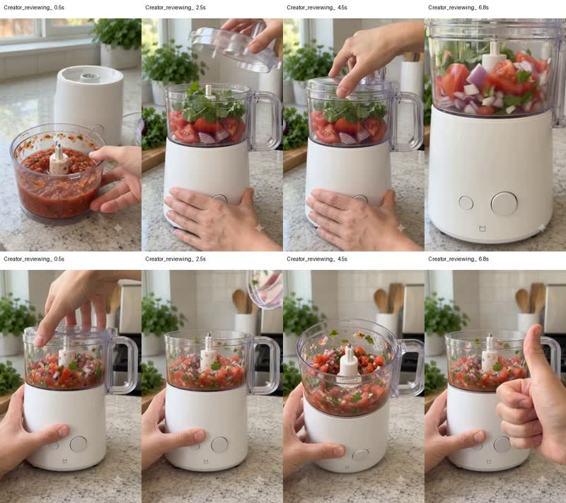

# Real-generation showcase

This directory contains proof cases where the skill is evaluated against an actual video-generation workflow.

The showcase is intentionally separate from `skills/`. The installable skill should stay focused on instructions and reusable references; testing history, output evidence, and iteration logs belong here.

## Featured case

### FLOW-APPLIANCE-001 — Google Flow / Veo appliance multi-state UGC

**Current status:** V01 and V02 have real generation evidence. V02 validates the split-clip approach but exposes a continuation-state regression in clip 2. V03 is prepared as a targeted clip-2-only repair.

**V01 QA:** `13 / 16`

**V01 lesson:** the original ~12-second story did not fit the tested 8-second-per-generation workflow cleanly. Recompiling as two native 8-second clips improved temporal and physical reliability.

**V02 result:** clip 1 is materially cleaner. Clip 2 incorrectly regresses to coarse/raw ingredients before the lid opens, then shows processed salsa afterward.

**V02 failure tags:** `STATE_DISCONTINUITY`, `NO_CAUSAL_TRANSITION`, minor `LID_GEOMETRY_DRIFT`.

**V03 repair:** keep V02 clip 1 unchanged and enforce an immutable post-processing opening state in clip 2. The finished salsa must exist before frame 1 and remain unchanged through lid opening.

### Evidence preview

#### V01



- [Watch V01 clip 1 — setup / processing](evidence/flow-appliance-001/v01-clip-1-preview.mp4)
- [Watch V01 clip 2 — reveal / verdict](evidence/flow-appliance-001/v01-clip-2-preview.mp4)

#### V02

The V02 contact sheet and both V02 video files are temporarily omitted. They will be uploaded manually at original or intentionally chosen quality rather than through an aggressively compressed preview pipeline.

- [Read V02 QA](evidence/flow-appliance-001/v02-qa.md)
- [Use the V03 clip-2 repair prompt](evidence/flow-appliance-001/v03-clip-2-prompt.md)
- [View product reference](evidence/flow-appliance-001/reference-product.jpg)
- [Open the full case →](appliance-multistate-google-flow.md)
- [Open the evidence bundle →](evidence/flow-appliance-001/README.md)

## Showcase standard

Every case should make the evidence chain easy to scan:

```text
REFERENCE / INPUT
        ↓
EXACT ASK
        ↓
AGENT ROUTE
        ↓
PROMPT V01
        ↓
REAL GENERATION
        ↓
QA + FAILURE TAGS
        ↓
ROOT CAUSE
        ↓
MINIMAL REPAIR
        ↓
PROMPT V02
        ↓
REGENERATION / COMPARISON
        ↓
TARGETED V03+ REPAIR WHEN A NEW ROOT CAUSE APPEARS
```

Do not present a case as a success simply because the output looks polished. Failures and limitations are first-class evidence.

## Recommended case layout

Keep the top of each case useful even for someone who does not read the full prompt:

1. short result summary
2. visual/reference evidence
3. generated preview/contact sheet
4. compact QA score
5. what changed in the repair
6. exact prompts and detailed diagnosis below

Use [CASE_TEMPLATE.md](CASE_TEMPLATE.md) for new showcase cases.

## Evidence policy

For representative cases, keep an evidence bundle near the case. Media should be uploaded at a quality that remains useful for visual inspection.

A typical case may contain:

```text
evidence/<case-id>/
├── README.md
├── reference-product.jpg
├── v01-contact-sheet.jpg
├── v01-clip-1-preview.mp4
├── v01-clip-2-preview.mp4
├── v02-qa.md
└── v03-clip-2-prompt.md
```

Additional generated media can be added manually when ready. Do not aggressively recompress showcase evidence simply to minimize file size.

If video or image size becomes unsuitable for normal Git history, prefer Git LFS or release assets while keeping stable links and, when useful, deliberately generated lightweight derivatives.

Every media item should state:

- whether it is a product reference, generated frame, or generated video;
- model/workflow used when known;
- generation date;
- prompt revision;
- whether the asset is original-resolution or a compressed preview;
- whether the output is unedited or post-processed.

## What a showcase should prove

The showcase exists to answer two questions:

1. Does the skill make the generation workflow more reliable?
2. When generation fails, does the skill produce a smaller and better-targeted repair rather than rewriting everything?

As cases accumulate, prioritize coverage over volume. Add different product categories, interaction patterns, model/workflow constraints, and failure classes instead of collecting near-duplicate attractive outputs.

## Promotion criteria

A case is ready to be highlighted from the repository root when it includes:

- an actual product/reference input;
- at least one real generated output;
- reproducible prompt revision(s);
- explicit QA evidence;
- honest failure notes;
- a targeted repair or a documented pass;
- media provenance.

A polished mockup without real generation evidence is an example, not a showcase.
