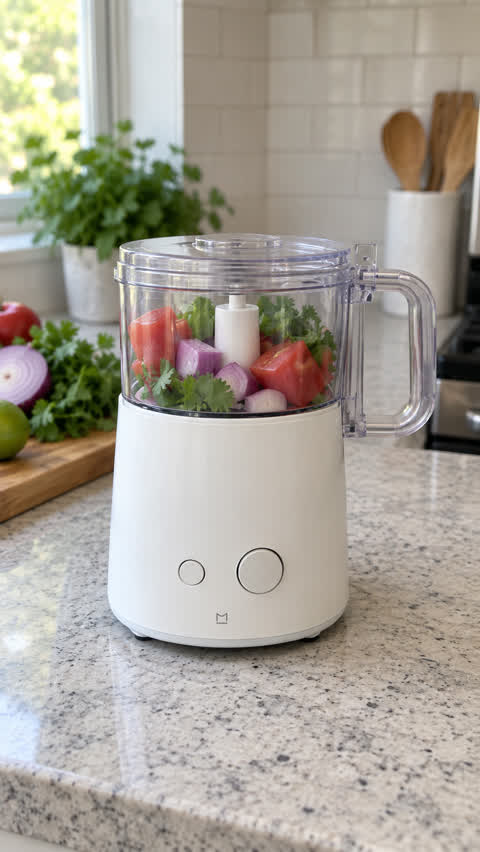
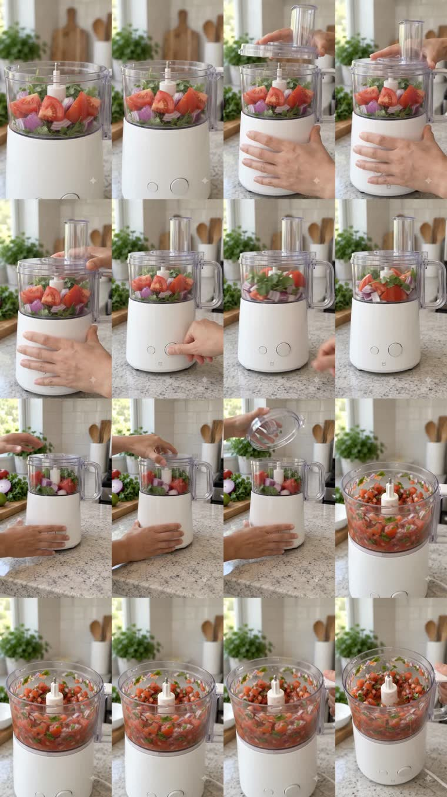

# FLOW-APPLIANCE-001 — Evidence

Real-generation evidence for the first appliance multi-state Google Flow / Veo showcase.

## Media bundle status

**V01, V02, and V03 evidence are published. V03 targeted repair passed.**

The evidence bundle contains:

- [reference-product.jpg](reference-product.jpg) — product reference used by the case.
- [v01-contact-sheet.jpg](v01-contact-sheet.jpg) — sampled frames across the original V01 outputs.
- [v01-clip-1-preview.mp4](v01-clip-1-preview.mp4) — V01 setup / processing generation.
- [v01-clip-2-preview.mp4](v01-clip-2-preview.mp4) — V01 reveal / verdict generation.
- [v02-contact-sheet.jpg](v02-contact-sheet.jpg) — V02 sampled frames.
- [v02-clip-1-preview.mp4](v02-clip-1-preview.mp4) — V02 ingredient proof → lid close → processing start.
- [v02-clip-2-preview.mp4](v02-clip-2-preview.mp4) — V02 attempted post-processing reveal / verdict.
- [v02-qa.md](v02-qa.md) — V02 QA and state-regression diagnosis.
- [v03-contact-sheet.jpg](v03-contact-sheet.jpg) — V03 clip-2 sampled frames.
- [v03-clip-2-preview.mp4](v03-clip-2-preview.mp4) — V03 targeted clip-2 regeneration.
- [v03-clip-2-prompt.md](v03-clip-2-prompt.md) — prompt used for the targeted repair.
- [v03-qa.md](v03-qa.md) — V03 QA and PASS decision.

Media for V02 and V03 was uploaded manually at the intended quality. Do not silently replace showcase media with heavily compressed derivatives.

## Quick visual review

### Product reference



### V01


- [Watch V01 clip 1 — setup / processing](v01-clip-1-preview.mp4)
- [Watch V01 clip 2 — reveal / verdict](v01-clip-2-preview.mp4)

### V02



- [Watch V02 clip 1 — ingredient proof / start](v02-clip-1-preview.mp4)
- [Watch V02 clip 2 — attempted result / verdict](v02-clip-2-preview.mp4)
- [Read V02 QA](v02-qa.md)

V02 validates the split-clip strategy but exposes a continuation-state regression in clip 2: the clip reintroduces coarse/raw ingredients before the reveal, then shows the processed result afterward.

### V03


- [Watch V03 clip 2 — targeted repair](v03-clip-2-preview.mp4)
- [Read the V03 prompt](v03-clip-2-prompt.md)
- [Read V03 QA](v03-qa.md)

V03 keeps V02 clip 1 unchanged and modifies one major variable only: the continuation clip receives an explicit immutable opening-state contract plus forbidden regressions.

The regenerated clip begins with the salsa already processed under the closed lid, then reveals that same finished state. The V02 causal failure is resolved.

## Repair lifecycle

```text
V01 — temporal overload / weak hero
↓
V02 — native split clips improve execution
↓
V02 clip 2 — continuation-state regression discovered
↓
V03 — immutable opening-state repair
↓
PASS
```

## Provenance

- Generation date: 2026-09-10 to 2026-09-11
- Workflow: Google Flow / Veo
- Tested practical generation duration: 8 seconds per output
- Prompt lineage: `V01 → V02 → V03 targeted clip-2 repair`
- Evaluation result: V03 passed at `15 / 16`; no V04 required for the observed root cause
- Media handling: preserve original-quality or intentionally chosen user uploads for showcase evidence

## Storage policy

Preserve showcase evidence at a quality that remains useful for visual inspection. Avoid aggressive recompression merely to make repository uploads smaller.

If media size becomes unsuitable for normal Git history, prefer Git LFS or release assets while keeping stable links and lightweight derivatives only when explicitly desired.

## Integrity rule

Do not replace a failed generation with a prettier recreation while keeping the same evidence label. A new generation must receive a new prompt/output revision so the chain remains auditable.
